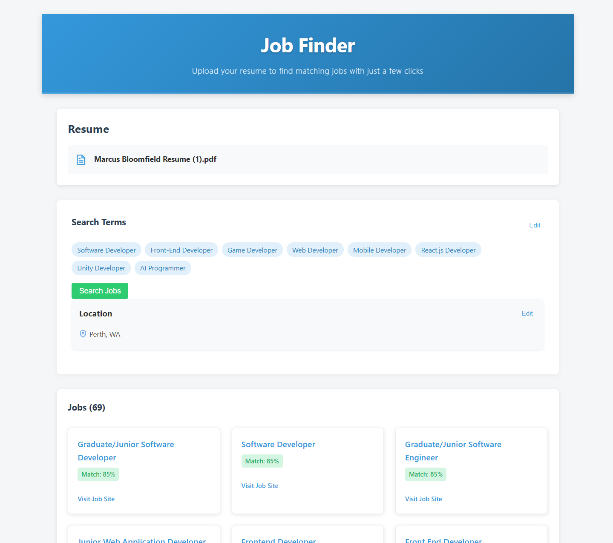

# WebJobFinder

WebJobFinder is a web application that helps job seekers find relevant job opportunities by analyzing their resume and matching it with scraped job listings.

## Application Interface

*Screenshot showing the Job Finder interface with resume upload, search terms selection, and job matching results*



## Features

- **Resume Upload**: Upload your resume in PDF or DOCX format
- **AI Analysis**: Uses OpenAI to extract relevant search terms from your resume
- **Job Scraping**: Scrapes job listings from popular job sites like Seek, Indeed, and LinkedIn
- **Smart Matching**: Evaluates how well each job posting matches your resume
- **Favorites**: Save jobs you're interested in for later review

## Project Structure

This project consists of two main parts:

1. **Frontend**: React application for the user interface
2. **Backend**: Express.js server that handles job scraping, resume parsing, and OpenAI integration

## Technology Stack

### Frontend
- React
- TypeScript
- Axios for API communication

### Backend
- Express.js
- TypeScript
- Puppeteer for web scraping
- Cheerio for HTML parsing
- Multer for file uploads
- PDF and DOCX parsing libraries

### Shared
- OpenAI API integration

## Prerequisites

- Node.js (v16 or later)
- NPM or Yarn
- OpenAI API key

## Installation and Setup

### Frontend

1. Install dependencies:
   ```
   npm install
   ```

2. Start the development server:
   ```
   npm start
   ```

3. Open http://localhost:3000 in your browser

### Backend

1. Navigate to the backend directory:
   ```
   cd backend
   ```

2. Install dependencies:
   ```
   npm install
   ```

3. Create a `.env` file with the following variables:
   ```
   PORT=5000
   NODE_ENV=development
   OPENAI_API_KEY=your_openai_api_key_here
   ```

4. Build the TypeScript code:
   ```
   npm run build
   ```

5. Start the development server:
   ```
   npm run dev
   ```

## Usage

1. Start both the frontend and backend servers
2. Enter your OpenAI API key when prompted (or configure it in the backend .env file)
3. Upload your resume (PDF or DOCX format)
4. Review the generated search terms or add your own
5. Click "Search Jobs" to find matching jobs
6. Review job listings and their match scores
7. Click on a job to view details and apply directly through the original job posting

## Security Note

When using the frontend only, your OpenAI API key is stored locally in your browser's localStorage. 
When using the backend, your API key should be securely stored in the backend's .env file.

## License

This project is licensed under the MIT License - see the LICENSE file for details.

## Acknowledgments

- Built as part of a job search optimization project
- Inspired by the challenges of finding relevant job matches in a busy market 
